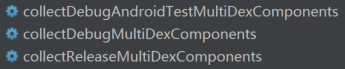
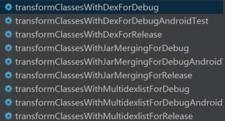
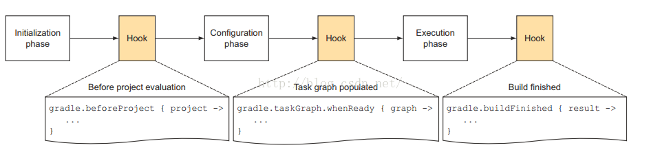

# Deprecated
Please use [multiDexKeepProguard](https://developer.android.com/studio/build/multidex?hl=zh-cn) to splite main dex classes.

# Android傻瓜式分包插件
[  ](https://bintray.com/tangxiaolv/maven/dexknife-plus/1.0.4/link)

注1：不想看前半部分的话可以直接跳过到最下面配置部分。  
注2：本插件是基于[DexKnifePlugin 1.6.2](https://github.com/ceabie/DexKnifePlugin)优化改造而来，感谢ceabie的无私奉献。

## 填坑之路  
### 坑1：65536 ，So easy!   
**原因：**Dalvik 的 invoke-kind 指令集中，method reference index 只留了 16 bits，最多能引用 65535 个方法。  
参考=>[由Android 65K方法数限制引发的思考](http://jayfeng.com/2016/03/10/%E7%94%B1Android-65K%E6%96%B9%E6%B3%95%E6%95%B0%E9%99%90%E5%88%B6%E5%BC%95%E5%8F%91%E7%9A%84%E6%80%9D%E8%80%83/).  

**解决：**  
```
android{
	defaultConfig {
		multiDexEnabled true
	}
}

dependencies { 
	compile 'com.android.support:MultiDex:1.0.1'
}
```
继承 Application ，重写 attachBaseContext(Context)
```
@Override 
protected void attachBaseContext(Context base) {
    super.attachBaseContext(base);
    MultiDex.install(this);
}
```

### 坑2：Too many classes in –main-dex-list ，what？  
**原因：**通过上面的官方分包，已经把原Dex分为1主Dex加多从Dex。主Dex包含所有4大组件，Application，Annotation，multidex等及其必要的直接依赖。由于我们方法数已达到16W之巨，上百个Activity全部塞进主Dex，又成功的把主Dex撑爆了。  

**解决：**
gradle
```
afterEvaluate { 
  tasks.matching { 
    it.name.startsWith('dex') 
  }.each { dx -> 
    if (dx.additionalParameters == null) { 
      dx.additionalParameters = []
    }  
    dx.additionalParameters += '--set-max-idx-number=48000' 
  } 
}
```
参考=>[Android Dex分包之旅](http://yydcdut.com/2016/03/20/split-dex/index.html)

### 坑3：gradle 1.5.0之后不支持这种写法 ，what the fuck？  
**原因：**官方解释Gralde`1.5.0`以上已经将(jacoco, progard, multi-dex)统一移到[Transform API](http://tools.android.com/tech-docs/new-build-system/transform-api)里，然而Transform API并没有想象的那么简单好用，翻遍Google终于找到一个兼容Gradle `1.5.0`以上的分包插件[DexKnifePlugin](https://github.com/ceabie/DexKnifePlugin)。  
扩展=>这篇[Android 热修复使用Gradle Plugin1.5改造Nuwa插件](http://blog.csdn.net/sbsujjbcy/article/details/50839263)比较好的介绍了Transform API的使用。

### 坑4：NoClassDefFoundError ，are you kiding me？  
**原因：**通过插件手动指定main dex中要保留的类，虽然分包成功，但是main dex中的类及其直接引用类很难通过手动的方式指定。  

**解决方式：**  
[美团Android DEX自动拆包及动态加载简介](http://tech.meituan.com/mt-android-auto-split-dex.html),他们是通过编写了一个能够自动分析Class依赖的脚本去算出主Dex需要包含的所有必要依赖。看来写脚本是跑不掉了。

### 坑5：自定义脚本 ，read the fuck source！  
**问题一：**哪些类是需要放入主Dex中？  
查看sdk\build-tools\platform-version\mainDexClasses.rules发现放入主Dex相关类有Instrumentation，Application，Activity，Service，ContentProvider，BroadcastReceiver，BackupAgent的所有子类。

**问题二：**gradle是在哪里算出主Dex依赖？  
查看Gradle编译任务发现有如下3个编译任务：  
  

运行collect任务，发现会在build/multi-dex目录下单独生成`manifest_keep.txt`文件，该文件其实就是通过上述规则扫描`AndroidManifest`生成。`manifest_keep.txt`保留的是所有需要放入主Dex里的类。还没完，接下来`transformClassesWithMultidexlist`任务会根据`manifest_keep.txt`生成必要依赖列表`maindexlist.txt`，这里面所有类才是真正放入主Dex里的。bingo，现在非常清楚，我们只需要控制进入manifest_keep.txt中的类即可，最终其类的依赖关系由系统帮我们生成即可，安全绿色可靠！  

  
 

**问题三：**在哪里控制`maindexlist.txt`的大小？  
由问题一我们知道生成`manifest_keep.txt`的规则，对于绝大部分工程来说，`manifest_keep.txt`中80%是Activity，其实我们并不需要把全部的Activity放入主Dex，只需要保留必要的Activity即可，如首页 Activity、Laucher Activity 、欢迎页的 Activity 等启动时必要的Activity就OK了。

下图是Gradle的工作流程：
  
来源：[深入理解Android之Gradle](http://blog.csdn.net/innost/article/details/48228651)  

我们只需要在完成任务向量图之后，执行任务之前Hook一下collect任务，过滤掉不必要的activity就OK了。添加Gradle：
```
//需要加入主dex的Activity列表
def mainDexListActivity = ['WelcomeActivity', 'MainFunctionActivity']
afterEvaluate {
    project.tasks.each { task ->
        if (task.name.startsWith('collect') && task.name.endsWith('MultiDexComponents')) {
            println "main-dex-filter: found task $task.name"
            task.filter { name, attrs ->
                String componentName = attrs.get('android:name')
                if ('activity'.equals(name)) {
                    def result = mainDexListActivity.find {
                        componentName.endsWith("${it}")
                    }
                    return result != null
                } else {
                    return true
                }
            }
        }
    }
}
```

### 坑6：主dex依然爆表，shit again！  
其实上面那段脚本已经成功筛选出我们想要放入主Dex的`manifest_keep列表`和`maindexlist列表`，但是在打包的时候还是把所有类打进主Dex(已无语)。这个时候就需要跟[DexKnifePlugin](https://github.com/ceabie/DexKnifePlugin)插件配合使用，首先在gradle中加上上述脚本，然后使用插件时在配置文件中加上 `-split **.**`和`#-donot-use-suggest`。DexKnifePlugin插件运行原理很简单，在生成Dex任务之前首先读取自己的配置文件(包含前面我们通过Gradle脚本生成的`maindexlist`列表)，然后扫描combined.jar(包含工程中所有.class文件)匹配出我们自定义的maindexlist.txt，再替换掉build/multi-dex/maindexlist.txt，和build实例。这样分包的时候就会基于我们的规则生成主Dex。

### 坑7：ANR，HAHAHA！  
我们最低API=16，测试并未发现ANR问题，所以暂时没考虑景上添花，这个问题比较好解决。  
参考=>[Android Dex分包之旅](http://yydcdut.com/2016/03/20/split-dex/index.html)

### Congratulation
恭喜，填坑终于结束，不过还有点不爽的是需要同时维护Gradle脚本和插件的配置。
于是乎就将Gradle脚本整合进了插件，这样只需维护一个配置文件就行了。读者可以根据自己需求自行选择分开配置还是整合配置。通过这种方式我们把主Dex的方法数维持在15000左右，从此再也不用担心方法数问题了！！！

## 配置部分
**第一步：添加分包支持**
```
android{
	defaultConfig {
		multiDexEnabled true
	}
}

dependencies { 
    compile 'com.android.support:MultiDex:1.0.1'
}

在继承的 Application中重写 attachBaseContext(Context)
@Override 
protected void attachBaseContext(Context base) {
    super.attachBaseContext(base);
    MultiDex.install(this);
}
```
**第二步：添加根目录Gradle**
```
buildscript {
    dependencies {
        classpath 'com.library.tangxiaolv:dexknife-plus:1.0.4'
    }
}
```
**第三步：在你的App模块的build.gradle添加插件**
```
apply plugin: 'dexknifePlus'
```
**第四步：配置参数**  
```
dexKnife{
    //必选参数
    enabled true //if false,禁用分包插件
    //可选参数
    //1.如果没有可选参数，将根据enabled决定是否分包。
    //2.如果有可选参数，需满足必选参数和可选参数的条件才允许分包
    productFlavor 'mock'
    buildType 'debug'

    /*
    *eg:当前productFlavors = dev，buildType = debug，
    *参数组合1：enabled = true，productFlavor = dev，buildType = debug 分包
    *参数组合2：enabled = true，productFlavor = mock，buildType = debug 不分包
    *参数组合1：enabled = true，buildType = debug 所有buildType = debug分包
    *参数组合1：enabled = true，productFlavor = dev 所有productFlavor = dev分包
    * */
}
```
**第五步：在你的App模块目录下新建dexknife.txt，并自定义配置**
```
#为注释符

#-----------主Dex中必要依赖的脚本配置-----------(支持依赖检测)
#默认保留四大组件中Service,ContentProvider,BroadcastReceiver三大组件,Activity组件选择性保留,若为空不保留任何Activity
-just activity com.ceabie.demo.MainActivity

#-----------附加类-----------(不支持依赖检测)
# 如果你想要某个包路径在maindex中，则使用 -keep 选项，即使他已经在分包的路径中.若为空，不保留任意类
#-keep com.ceabie.demo.**

# 保留单个类.
#-keep android.support.v7.app.AppCompatDialogFragment.class

# 这条配置可以指定这个包下类在第二及其他dex中.
#-split android.support.v?.**
#将全部类移出主Dex
-split **.**

# 不包含Android gradle 插件自动生成的miandex列表.(不使用建议的依赖树，注释掉表示使用,否则-just activity无效)
#-donot-use-suggest

# (分割每个dex包的方法数上限) 扩展参数:例如 --set-max-idx-number=50000
# 如果出现 DexException: Too many classes in --main-dex-list, main dex capacity exceeded：
# 表明限制的方法数小于main dex的必要方法数，调大到合适数值即可
-dex-param --set-max-idx-number=4000

# 注释掉将执行自定义dex分包，否则执行默认分包.
#-auto-maindex

# 显示miandex的日志.
#-log-mainlist
```

**第六步：在 defaultConfig 或者 buildTypes中打开 multiDexEnabled true，否则不起作用**

**使用前先参阅 DexKnife 的[特性部分](https://github.com/ceabie/DexKnifePlugin#特性重要)**

## 已知错误

注：分包的时候如果发现一些莫名的错误，可以关掉instant run，一般都能解决

**错误1：** (已修复)
```
Error:Execution failed for task ':Toon:transformClassesWithDexForDebug'.> java.lang.NullPointerException (no error message)
```
发生此错误只要切换一次Gradle版本就OK了，比如1.5.0

**错误2：**(已修复)
```
Unsupported major.minor version 52.0
```
由于插件中使用到了JDK1.8的一些API，所以将JDK升级到1.8就可以了

**错误3：** (已修复)
```
Error:Execution failed for task ':app:transformClassesWithDexForDebug'.
> DexKnife Warnning: Main dex is EMPTY ! Check your config and project!
```
gradle 切到 1.5.0，目前就发现gradle 2.1.2有这问题。
